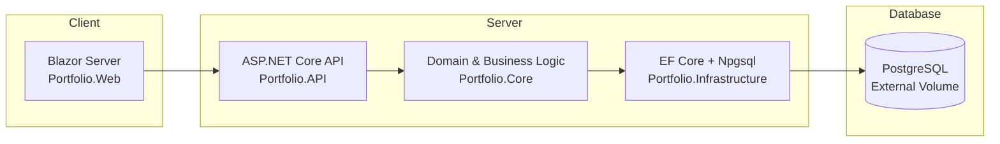

# Portfolio


A modular .NET 8 solution showcasing clean architecture, a Blazor front‑end, and reproducible production workflows.

---

## Architecture Diagram



---

## Overview
- Demonstrates my approach to building production‑ready .NET systems  
- Highlights clean architecture boundaries and modular solution structure  
- Includes reproducible workflows, automated quality gates, and containerized environments

## Highlights
- Clean architecture with strict project boundaries  
- Fully containerized local environment (API + Postgres)  
- Automated quality gates (Husky, commitlint, dotnet format)  
- Reproducible migrations and environment setup  
- Cross‑platform developer experience (Bash, Git Bash, PowerShell)

---

## Projects
- `Portfolio.API` — ASP.NET Core Web API  
- `Portfolio.Web` — Blazor (server‑side) front‑end  
- `Portfolio.Core` — domain models and business rules  
- `Portfolio.Infrastructure` — EF Core + Npgsql data access and integrations

## Architecture & Stack
- Clean architecture boundaries (API ↔ Core ↔ Infrastructure)  
- EF Core + PostgreSQL  
- Blazor for interactive UI  
- Tooling: Docker/Compose, Husky + commitlint, `dotnet format`

## Prerequisites
- Docker Desktop  
- .NET 8 SDK

---

## Quickstart

### 1. Clone and Configure

```bash
git clone https://github.com/awm-builds/awm.builds-systems-portfolio.git
cd awm.builds-systems-portfolio
```

### Copy Environment File

**macOS/Linux/WSL/Git Bash:**
```bash
cp .env.example .env
```

**PowerShell:**
```powershell
Copy-Item .env.example .env
```

### 2. Create External Volume (One-Time)

```bash
docker volume create portfolio_pgdata
```

### 3. Start Services

**Option A: Interactive Menu (Recommended)**

**Windows:**
```bash
.\docker-compose-menu.bat
```

**macOS/Linux/Git Bash (first time only):**
```bash
chmod +x docker-compose-menu.sh
```

**Subsequent runs:**
```bash
./docker-compose-menu.sh
```

Select option `1` to run containers.

**Option B: Direct Command**
```bash
docker compose up --build
```

### Access the application

```text
http://localhost:5001
```

**Services**
- API: http://localhost:5000 (container 8080 → host 5000)  
- Web: http://localhost:5001 (container 8080 → host 5001)  
- Postgres: localhost:55432 (container 5432 → host 55432)  
- Health: http://localhost:5000/health

---

## Why these scripts exist

This project uses an **external PostgreSQL volume**, which means your database is **fully protected during normal Docker operations**. As long as the external volume is enabled (the default configuration), your data cannot be deleted by `docker compose down` or other routine commands.

The only situation where the database can be removed is if:

- the external‑volume setting is intentionally disabled or modified, **and**  
- `docker compose down -v` is executed.

Because `down -v` bypasses normal safeguards *when the volume is not external*, the menu provides a controlled interface that prevents accidental use of destructive commands and requires explicit confirmation before resetting the database.

### Menu options

1. **Run containers (with build)** — Starts the full environment  
2. **Stop containers (SAFE)** — Runs `docker compose down` and preserves all data  
3. **Reset database (DANGEROUS)** — Runs `docker compose down -v`  
   - Requires typing `DELETE` in all caps  
   - Only used when intentionally resetting to a clean state  
4. **Exit** — Close the menu  

### Benefits

- Database is **safe by default** thanks to the external volume  
- Prevents accidental use of destructive commands  
- Clear separation between safe and destructive operations  
- Multi‑layer confirmation for data‑reset actions  
- Works consistently across Windows, macOS, Linux, WSL, and Git Bash  
- Encourages a reproducible, safety‑first workflow  

### One‑time setup for external volume

The PostgreSQL volume is defined as **external** to ensure it cannot be deleted by normal container operations.

Create it once:

```bash
docker volume create portfolio_pgdata
```

This volume will persist your database data across container restarts and removals.

---

## Stop & Clean

**Safe stop (recommended):**  
Stops containers while preserving data stored in the `pgdata` volume.

**⚠️ Destructive reset (use menu instead):**  
Deletes the database volume and all stored data.  
Use the Database Safeguard Menu to avoid accidental data loss.

---

## Environment

Copy `.env.example` to `.env` and adjust as needed:

- `POSTGRES_USER`, `POSTGRES_PASSWORD`, `POSTGRES_DB`  
- `DB_PORT_EXTERNAL` (host port for Postgres)  
- `CONNECTIONSTRINGS__POSTGRES` (API connection string)

---

## Run Locally (without Docker)

1. Start Postgres and ensure the connection string is configured (User Secrets or `appsettings.Development.json`):

```json
"ConnectionStrings": {
  "Postgres": "Host=localhost;Port=55432;Database=portfolio;Username=postgres;Password=postgres"
}
```

2. Run the API:
```bash
dotnet run --project Portfolio.API
```

3. Run the Blazor front‑end:
```bash
dotnet run --project Portfolio.Web
```

---

## Database Migrations

Run migrations from Infrastructure using the API as the startup project:

```bash
dotnet ef migrations add <Name> --project Portfolio.Infrastructure --startup-project Portfolio.API
dotnet ef database update --project Portfolio.Infrastructure --startup-project Portfolio.API
```

---

## Quality Gates
- Formatting: `dotnet format` (enforced via Husky pre‑commit hook)  
- Commit style: Conventional Commits (commitlint)

---

## Troubleshooting
- **Port in use:** Adjust `DB_PORT_EXTERNAL` or the API host port in `docker-compose.yml`.  
- **Database issues:** Use the Docker Compose menu (`docker-compose-menu.bat` or `docker-compose-menu.sh`) to safely manage containers and volumes.

---

## License
This project is licensed under the MIT License. See the `LICENSE` file for details.